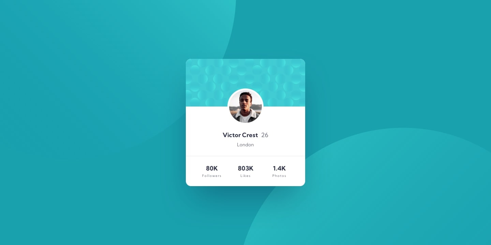

# Frontend Mentor - Profile card component solution

This is a solution to the [Profile card component challenge on Frontend Mentor](https://www.frontendmentor.io/challenges/profile-card-component-cfArpWshJ). Frontend Mentor challenges help you improve your coding skills by building realistic projects. 

## Table of contents

- [Overview](#overview)
  - [The challenge](#the-challenge)
  - [Screenshot](#screenshot)
  - [Links](#links)
- [My process](#my-process)
  - [Built with](#built-with)
- [Author](#author)

## Overview

### The challenge

- Build out the project to the designs provided

### References Screenshots

### Links

- Solution URL: [https://www.frontendmentor.io/solutions/profile-card-component-mobile-first-media-queries-responsive-Hniw3yUgZ3]
- Live Site URL: [https://samuelabreu74.github.io/Profile-Card-Component/]

## My process

### Built with

- Semantic HTML5 markup
- CSS custom properties & Media Queries
- Flexbox
- Mobile-First Workflow

## Author

- Frontend Mentor - [@SamuelAbreu74](https://www.frontendmentor.io/profile/SamuelAbreu74)
- Instagram - [@samuelabreu.dev](https://www.instagram.com/samuelabreu.dev/)
- Github - [@SamuelAbreu74](https://github.com/SamuelAbreu74)